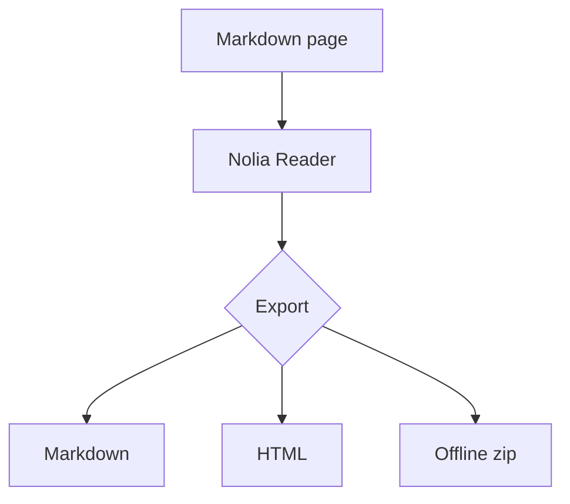

# Nolia Reader QA Sample

This document exercises the P0 and P1 renderer surface.

## GFM

- [x] Task list item
- [ ] Pending task item

| Feature | Status |
| --- | --- |
| Tables | Supported |
| Footnotes | Supported |

A link to [OpenAI](https://openai.com) and an image:


## Code

```ts
const message = "copy me";
console.log(message);
```

## Math

Inline math: $E = mc^2$.

Block math:

$$
\int_0^1 x^2 dx = \frac{1}{3}
$$

## Mermaid



## Callout

> [!NOTE]
> This callout should render with a title and visual treatment.

## Wikilink

See [[Nolia Reader|the reader]] and [[Nolia Reader QA Sample#GFM]].

## Footnote

Markdown footnotes should work.[^note]

[^note]: This is the footnote body.
